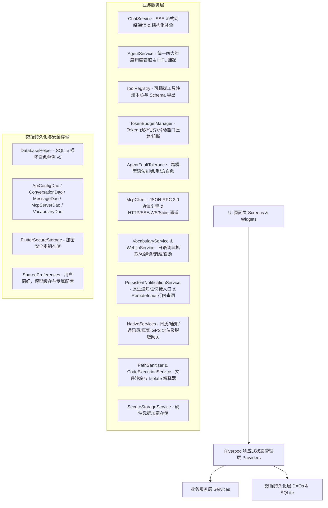

# Chat - 现代化 Flutter AI Agent 移动端客户端

<div align="center">


-003B57?style=for-the-badge&logo=sqlite&logoColor=white)


<p align="center">
  <b>一款基于 Flutter 构建的高颜值、高性能、高可用的全功能移动端 AI 智能体、MCP 生态与日语生词本客户端</b><br/>
  支持 OpenAI 规范 · MCP 客户端 (Streamable HTTP / SSE / WS / Stdio) · 日语生词本 (Weblio / AI 兜底 / Anki) · 通知栏常驻与行内查词 (RemoteInput) · 本地沙箱文件与 Isolate 执行 · LaTeX 数学公式 · 移动原生特权 · Token 预算熔断 · 跨模型自愈
</p>

</div>

---

## 📑 目录

- [✨ 核心特性全景](#-核心特性全景)
  - [1. 开放模型与多服务商接入](#1-开放模型与多服务商接入)
  - [2. Model Context Protocol (MCP) 客户端与网桥](#2-model-context-protocol-mcp-客户端与网桥)
  - [3. 智能体工具库与参数自愈 (四大维度核心收敛)](#3-智能体工具库与参数自愈-四大维度核心收敛)
  - [4. 全局 Token 预算与滑动窗口压缩 (1M 预算)](#4-全局-token-预算与滑动窗口压缩-1m-预算)
  - [5. 跨模型容错与对抗自愈网关](#5-跨模型容错与对抗自愈网关)
  - [6. 深度思考链、LaTeX 数学公式与 HITL 确认](#6-深度思考链latex-数学公式与-hitl-确认)
  - [7. 日语生词本学习体系与智能翻译](#7-日语生词本学习体系与智能翻译)
  - [8. 系统通知栏常驻快捷查词与行内搜索](#8-系统通知栏常驻快捷查词与行内搜索)
  - [9. 本地安全沙箱管理与工作区系统](#9-本地安全沙箱管理与工作区系统)
- [🏛️ 系统架构图与技术栈](#️-系统架构图与技术栈)
- [📂 核心目录与代码地图](#-核心目录与代码地图)
- [🚀 快速开始与编译部署](#-快速开始与编译部署)
  - [环境依赖](#环境依赖)
  - [安装依赖与运行](#安装依赖与运行)
  - [Android APK 编译打包](#android-apk-编译打包)
- [📄 开源协议](#-开源协议)

---

## ✨ 核心特性全景

### 1. 开放模型与多服务商接入
- **广泛兼容**：无缝对接 OpenAI、9Router、DeepSeek、Moonshot、Google AI Studio 等所有符合 `/v1/chat/completions` 标准的服务商。
- **免 Key 开箱即用**：内置预置 **OpenCode Free** 免费通道（直连 `https://opencode.ai/zen/v1`），初次安装自动加载主流免 Token 免费模型（如 `deepseek-v4-flash-free`）。
- **模型持久化缓存与秒开**：拉取的模型列表写入 `SharedPreferences` 持久化，应用重启无需重复拉取网络；记忆并恢复上次使用的模型（`last_selected_model_$configId`），支持主页与设置页手动强制刷新。
- **凭据安全**：API Key 采用 `flutter_secure_storage` 安全硬件加密存储，本地 SQLite 数据库仅存引用键（Ref），绝无明文泄露风险。

### 2. Model Context Protocol (MCP) 客户端与网桥
- **四大多路传输通道 (Transports)**：
  - **Streamable HTTP (`type: "http"`, `POST /mcp`)**：符合 MCP 官方最新 HTTP 规范，直接通过 POST 携带 JSON-RPC 通信，支持单响应、批量响应、SSE 分块及 `Mcp-Session-Id` 会话维护；具备极速直连通道，避免无效 GET 挂起；
  - **Server-Sent Events (SSE + POST)**：经典 SSE 传输通道，遵循 W3C 标准以空行分隔事件并支持跨行 `data:` 拼接，具备 400/404/405 智能降级自愈；
  - **WebSocket (WS / WSS)**：实时全双工长连接通道；
  - **Stdio (Process)**：本地子进程标准 I/O 管道（桌面端支持与优雅降级）。
- **后台自动静默连接**：应用冷启动时自动在后台静默连接所有已启用的 MCP 服务，无需手动进入设置页；调用前自动检测连通性并在断网时自愈重连。
- **动态工具发现与注销**：自动探测远程工具 Schema 转为 OpenAI Function Calling 格式，并以 `mcp_{serverId}_{toolName}` 命名空间动态注入 `ToolRegistry`，断开连接时自动注销。
- **一键 JSON 配置导入**：支持一键粘贴 Claude Desktop / Cursor / OpenCode 的标准 JSON 配置，自动解析服务名、协议与端点并适配小屏布局。

### 3. 智能体工具库与参数自愈 (四大维度核心收敛)
系统内置 4 级安全权限模型（`Safe 0`、`ReadOnly 1`、`SensitiveConfirm 2`、`PrivilegedNative 3`）。核心内置静态工具默认收敛精简为 14 个高频工具，降低大模型上下文噪音；移动原生特权工具默认按需开启，配合动态 MCP 工具实现全生态覆盖：

| 维度 | 工具名称 | 权限等级 | 功能描述 |
|---|---|:---:|---|
| **基础实用** | `math_eval` | Level 0 | 高精数学表达式、三角函数、统计计算与单位转换 |
| | `time_calculator` | Level 0 | 全球 IANA 时区查询、跨时区转换、相对时间与时间差计算 |
| | `weather_query` | Level 0 | Open-Meteo 免 Key 实时天气与 7 天逐日天气预报 |
| | `web_search` / `google_search` / `bing_search` | Level 0 | SearXNG 聚合检索、Google Grounding 接地与 Bing 搜索 |
| | `url_fetch` | Level 1 | 网页全文抓取、DOM 清洗、表格转 Markdown 与 15K 字符智能截断感知 |
| **文件与代码** | `file_read` | Level 1 | 本地沙箱文件安全读取（支持按行分块分页） |
| | `file_write` | Level 2 (HITL) | 本地沙箱文件写入与变更 Diff 快照生成 |
| | `file_list` | Level 1 | 递归遍历沙箱文件树（支持通配符 glob/正则，自动过滤重型构建目录） |
| | `file_delete` | Level 2 (HITL) | 本地沙箱文件安全删除 |
| | `code_eval` | Level 2 (HITL) | 独立 Worker Isolate 隔离脚本解释执行（3000ms 硬超时强杀，支持自定义函数/递归） |
| | `clipboard_read` / `clipboard_write` | Level 1 / Level 2 | 系统剪贴板安全读取与写入 |
| **移动原生特权**<br/>*(可按需开启)* | `calendar_query_events` | Level 3 | 自然语言与时间范围日历日程检索 |
| | `calendar_create_event` | Level 3 (HITL) | 系统日历创建日程、自然语言日期解析与重叠冲突预警 ($S_1 < E_2 \land E_1 > S_2$) |
| | `notification_schedule` | Level 3 (HITL) | 系统本地精准定时通知、中文自然时间解析与提醒设定 |
| | `notification_cancel` | Level 3 | 按 ID 或标题关键词取消与清空待触发通知 |
| | `contacts_search` | Level 3 | 通过 `ContactsSanitizer` 安全脱敏检索通讯录（E.164 掩码、防注入转义、单次 5 条上限） |
| | `geolocation_get` | Level 3 | 基于 `RealLocationService` 真实 IP 定位与 GPS 经纬度获取 |
| | `reverse_geocode` | Level 0 | 经纬度通过 OpenStreetMap 逆向解析为具体街道/城市地址 |
| **远程动态** | `mcp_{serverId}_{toolName}` | 自定义 | 动态由外部 MCP Server 提供的远程特权/计算/数据工具 |

- **统一参数别名自愈机制**：内置 `_resolveToolNameAlias` 与模糊别名映射，自动纠正模型非标输出（如将 `title`/`start_time`/`body`/`scheduled_time`/`path`/`code`/`query`/`lat`/`lng` 智能映射到契约参数），彻底消除模型入参微瑕疵导致的调用失败。

### 4. 全局 Token 预算与滑动窗口压缩 (1M 预算)
- **精准 Token 估算算法**：采用针对 CJK 汉字（0.65 token/char）、英文与代码（0.25 token/char）、Emoji 及结构化 JSON 的多模态精确估算模型。
- **1,000,000 (1M) 默认预算上限**：默认 Token 上限扩充至 1M，全面拥抱长上下文模型能力。
- **智能滑动窗口压缩**：超长多轮工具链中自动剪裁早期冗长的中间文本，保留工具签名与精炼头尾摘要，防止长会话上下文超限。
- **全局超限熔断器 (Circuit Breaker)**：达到 Token 硬上限时自动触发熔断，剥离后续工具并强制引导模型完成最终总结优雅收尾。

### 5. 跨模型容错与对抗自愈网关 (`AgentFaultTolerance`)
- **多模型语法入参纠错**：兼容修复 DeepSeek DSML v1/v2、Qwen XML、标准 OpenAI JSON、Llama 函数语法中的畸形转义、未闭合引号、括号与非法逗号。
- **指数退避重试 (Exponential Backoff with Jitter)**：外部网络抖动或限流时自动带随机抖动重试。
- **自适应降级引导**：工具超时或崩溃时向大模型返回结构化中文友好错误上下文，促成自主计划修正。

### 6. 深度思考链、LaTeX 数学公式与 HITL 确认
- **LaTeX 数学公式排版渲染 (`flutter_math_fork`)**：
  - 支持块级公式 `$$...$$`、`\[...\]` 与行内公式 `$...$`、`\(...\)`；
  - 完整支持标准 LaTeX 环境（`equation`, `align`, `aligned`, `gather`, `matrix`, `pmatrix`, `bmatrix`, `cases` 等）；
  - 智能解析中日韩（CJK）汉字紧邻公式边界（如 `公式$E=mc^2$推导`）；
  - 智能负向判定，彻底防止常规美元货币金额（如 `$100 USD`）被误识别为数学公式；
  - 提供专属 TeX 徽标、横向滚动防溢出与一键复制原始 LaTeX 源码功能。
- **深度思考过程 Markdown 富文本渲染与独立复制**：思考链（`reasoningContent`）支持 Markdown 排版（代码块、列表、表格），并提供独立「复制思考」按钮与划词选择。
- **6 档全英文思考等级**：设置页支持 `None`, `Minimal`, `Low`, `Medium`, `High`, `Max` 6 档深度推理强度调节。
- **多步执行折叠时间线 (`AgentExecutionTimelineWidget`)**：直观展示 Agent 思考过程、步骤耗时、各维度工具调用链路与状态芯片。
- **Human-in-the-Loop 交互确认卡片 (`ToolConfirmationCard`)**：触发 Level 2/3 敏感操作时挂起等待用户确认，提供代码/文本差异对比（`DiffViewerWidget`），支持用户一键允许或填写拒绝理由引导模型自适应调整。
- **Token 响应式胶囊徽章 (`TokenBudgetBadge`)**：实时显示单步与全局消耗，并在触发熔断时呈现直观警示卡片。

### 7. 日语生词本学习体系与智能翻译
内置全功能日语生词本学习模块，专为日语学习者打造从快速查词、智能消歧、地道翻译到复习管理的一站式体验：
- **权威词典 Weblio 深度解析 (`WeblioService`)**：
  - 优先精准抓取小学馆《デジタル大辞泉》（SGKDJ），智能降级通用词典或例文辞书（WNRYJ）；
  - **语法活用/重定向“查到底”（Trace-to-Root Recursion）**：遇到「講じる」（大辞泉标注「『講ずる』の上一段化」）或箭头引用词条，自动递归穿透追踪根词并合并实质多义项释义；
  - 词干自动还原与例句防叠字拼装，生成规范 Anki 假名 Ruby 标注。
- **LLM 智能翻译与 AI 兜底自愈 (`VocabularyService`)**：
  - 结构化 JSON 提示词生成规范词性、地道简体中文释义与中日双语对照例句；
  - **元语言语法套话清洗**：严格剥离“是…的上一段活用”等元语言套话，直达词汇实质词义；
  - **全量 AI 兜底**：词典未收录生僻词或网络异常时，全自动调用 LLM 生成假名、词性、日文释义、中文释义与例句并入库持久化；
  - **本地缓存自愈与一键重翻译**：本地已有词条若缺失中文释义自动触发补全；生词卡片支持一键重新翻译刷新。
- **纯假名消歧与 AI 笔误推测**：
  - **纯假名消歧 (Disambiguation)**：输入平假名/片假名时，AI 智能推荐 2~6 个最常用的汉字候选词并附带地道释义标签；
  - **拼写笔误智能推测 (AI Typo Inference)**：输入未收录或拼写笔误时，智能推测用户意图并提供修正候选；
  - 候选词交互确认卡片支持一键点选入库或坚持原输入强制查询。
- **专属独立翻译模型配置 (`VocabularyConfigProvider`)**：
  - 生词本可单独配置供应商（`ApiConfig`）与具体翻译模型（`ModelInfo`），与聊天主模型完全隔离互不干扰；
  - 针对非 OpenCode 供应商（OpenAI、DeepSeek、SiliconFlow 等）自适应匹配端点合法模型（如 DeepSeek 使用 `deepseek-chat`），杜绝向第三方分发 OpenCode 免费模型引发的报错；
  - 继承历史供应商使用记忆（`last_selected_model_$configId`），支持自定义模型 ID 录入与一键恢复默认。
- **SQLite v5 持久化存储 (`VocabularyDao`)**：对齐 Anki 模板字段，内置汉字查重索引与时间排序索引，支持列表搜索过滤、滑动删除与原子去重。

### 8. 系统通知栏常驻快捷查词与行内搜索
突破应用前台限制，实现系统通知栏原生查词生态：
- **常驻通知栏快捷入口**：Android 通知栏无声低打扰常驻卡片，点击一键唤醒并平滑跳转至生词本界面，支持自动聚焦查词输入框。
- **Android 原生 `RemoteInput` 行内直接查词**：无需打开 App，在系统通知栏点击「🔍 输入单词」即可直接调起键盘键入单词提交查询。
- **`BigTextStyle` 展开式双语释义卡片**：直接在通知栏展开显示假名读音、词性、中日双语释义与例句，带有搜索中动态进度条，配置 `onlyAlertOnce(true)` 杜绝频繁震动打扰。
- **原生 Android 前台服务 (`PersistentNotificationForegroundService`)**：适配 Android 14+ 严格前台服务合规要求（`dataSync` 类型），平时轻量保活，查词时按需拉起后台 `FlutterEngine` 懒加载运行，取消常驻通知时彻底销毁后台引擎释放内存。
- **后台插件注册与冷启动队列保护**：显式注册后台 `FlutterEngine` 插件，引入冷启动待处理查询缓冲队列（`pendingInlineQueries`）与单调递增序号（`_searchSeq`），杜绝丢词风险与慢网络乱序覆盖。

### 9. 本地安全沙箱管理与工作区系统
- **应用内沙箱文件可视化管理 (`SandboxManagementScreen`)**：直观展示存储配额占用进度条、沙箱文件与目录树、文本与图片预览、一键导出与安全清空。
- **工作区路径自定义与 Android 符号链接自愈**：
  - 完美解决 Android `/data/user/0` 与 `/data/data` 符号链接导致的路径逃逸误报；
  - 支持自定义工作区路径，系统提示词智能感知移动与桌面环境；
  - 严格拦截 WSL 宿主机与 Windows 盘符越权遍历。
- **多语言 Isolate 代码解释器深度增强 (`CodeExecutionService`)**：
  - 支持 `void main()` / `main()` 自动执行与 `import` 语句自动剥离；
  - 内置注入 `Math` 与全局 `console` 对象；
  - 内置 `len`、`range` 辅助函数，全面支持用户自定义函数与递归调用；
  - 3000ms 硬超时强杀回收，安全隔离防止死循环。

---

## 🏛️ 系统架构图与技术栈



---

## 📂 核心目录与代码地图

```
lib/
├── main.dart                          # 应用入口，全局初始化与 ProviderScope
├── app.dart                           # MaterialApp 根配置（多主题、路由映射、通知栏跳转拦截）
│
├── models/                            # 数据模型 (JSON 序列化)
│   ├── agent_step_telemetry.dart      # Agent 多步执行遥测与统计模型
│   ├── api_config.dart                # API 服务商配置模型
│   ├── chat_message.dart              # 聊天消息模型（支持思考链、多模态、Tokens 统计）
│   ├── conversation.dart              # 对话元数据（置顶、归档、独立系统提示词）
│   ├── model_info.dart                # 模型元数据（Vision/Tools 能力标签）
│   ├── vocabulary_entry.dart          # 日语生词条目模型（对齐 Anki 字段规范）
│   ├── word_candidate.dart            # 候选词模型（纯假名消歧与笔误推测）
│   ├── mcp/                           # MCP 协议模型
│   │   ├── mcp_json_rpc.dart          # JSON-RPC 2.0 协议对象
│   │   ├── mcp_server_config.dart     # MCP Server 持久化配置
│   │   ├── mcp_server_state.dart      # MCP Server 运行时状态
│   │   ├── mcp_tool_info.dart         # MCP 远程工具/资源/Prompt 元数据
│   │   └── mcp_transport_type.dart    # 传输类型枚举 (http/sse/websocket/stdio)
│   └── tool/                          # 工具基类与权限模型
│       ├── tool.dart                  # 标准 Tool 抽象基类
│       ├── tool_execution_result.dart # 执行结果与 Markdown/JSON 视图
│       └── tool_security_level.dart   # 4 级安全权限模型
│
├── data/                              # 数据访问对象 (DAO) 与数据库管理
│   ├── database_helper.dart           # SQLite 单例（损坏自愈与 Schema v5 迁移）
│   ├── api_config_dao.dart            # API 服务商配置持久化
│   ├── conversation_dao.dart          # 对话与会话持久化
│   ├── message_dao.dart               # 消息持久化（沙盒图片绝对路径映射）
│   ├── mcp_server_dao.dart            # MCP 服务器配置与安全 Header 持久化
│   └── vocabulary_dao.dart            # 日语生词本数据库持久化（去重查重与索引）
│
├── services/                          # 核心业务服务层
│   ├── chat_service.dart              # SSE 流式传输驱动与结构化补全接口
│   ├── agent_service.dart             # 四大维度工具统一调度管道与 HITL 协调
│   ├── tool_registry.dart             # 统一工具注册中心（别名自愈与动态注入）
│   ├── token_budget_manager.dart      # 全局 Token 预算与滑动窗口压缩引擎 (1M)
│   ├── agent_fault_tolerance.dart     # 跨模型容错纠错与自愈网关
│   ├── agent_loop_guard.dart          # 死循环与振荡调用防御
│   ├── vocabulary_service.dart        # 生词本核心业务编排（Weblio抓取+AI翻译+自愈）
│   ├── weblio_service.dart            # Weblio 权威词典解析器（递归查到底/例句还原）
│   ├── image_service.dart             # 图片压缩与沙盒存储
│   ├── secure_storage_service.dart    # 硬件安全密钥存储
│   ├── path_sanitizer.dart            # 安全沙箱路径净化与 Android 符号链接别名自愈
│   ├── code_execution_service.dart    # Isolate 代码解释器（AST控制流/函数/Math）
│   ├── mcp/                           # MCP 核心服务
│   │   ├── json_rpc_engine.dart       # JSON-RPC 2.0 异步引擎 (60s 超时)
│   │   ├── mcp_client.dart            # MCP 协议核心驱动（自动重连与健康心跳）
│   │   ├── mcp_dynamic_tool.dart      # MCP 动态工具适配器
│   │   └── transports/                # HTTP (Streamable) / SSE / WebSocket / Stdio 传输实现
│   ├── native/                        # 移动原生特权服务抽象与脱敏
│   │   ├── persistent_notification_service.dart # 系统常驻通知与行内搜索通道服务
│   │   ├── real_location_service.dart # 真实 IP 与 OpenStreetMap 逆地理编码服务
│   │   ├── calendar_service.dart      # 日历日程读写、自然语言时间解析与冲突检测
│   │   ├── notification_service.dart  # 本地精准定时通知与提醒
│   │   ├── contacts_service.dart      # 通讯录服务
│   │   ├── contacts_sanitizer.dart    # 通讯录隐私脱敏与防注入网关
│   │   └── permission_manager_service.dart # 统一权限管理与中文降级
│   └── tools/                         # 内置工具库实现 (file/code/math/time/weather/search)
│
├── providers/                         # Riverpod 状态管理层
│   ├── chat_provider.dart             # 消息流、编辑、回退、重新生成控制器
│   ├── agent_provider.dart            # Agent 多步遥测与执行状态
│   ├── mcp_provider.dart              # MCP 多 Server 生命周期管理与自动连接
│   ├── vocabulary_provider.dart       # 生词本状态机（查词、消歧、列表、删除、重翻译）
│   ├── vocabulary_config_provider.dart# 生词本专属翻译模型与独立供应商选择
│   ├── persistent_notification_provider.dart # 常驻通知栏状态、偏好与行内查词监听
│   ├── conversation_provider.dart     # 会话管理
│   ├── api_config_provider.dart       # API 配置管理
│   ├── model_provider.dart            # 模型拉取、持久化缓存与上次记忆
│   ├── settings_provider.dart         # 设置项管理（沙箱开关、工作区路径、思考等级）
│   └── theme_provider.dart            # 主题模式管理
│
├── screens/                           # 核心 UI 界面
│   ├── home_screen.dart               # 主聊天界面（侧边栏、流式对话、思考面板、提示词入口）
│   ├── vocabulary_screen.dart         # 日语生词本界面（查词输入、模型指示Chip、生词卡片、消歧卡片）
│   ├── sandbox_management_screen.dart # 本地安全沙箱管理与文件导出预览界面
│   ├── mcp_server_management_screen.dart # MCP 服务器可视化管理与一键 JSON 导入
│   ├── api_config_screen.dart         # API 提供商管理
│   ├── model_selector_screen.dart     # 模型选择页（厂商分组、能力标签、缓存刷新）
│   ├── system_prompt_screen.dart      # 系统提示词模板库
│   └── settings_screen.dart           # 全局设置页（生词本专属模型、工作区、沙箱开关）
│
└── widgets/                           # 可复用 UI 视图组件
    ├── chat_bubble.dart               # 消息气泡（Markdown、思考面板、Token 胶囊）
    ├── markdown_renderer.dart         # Markdown 渲染器（LaTeX 数学公式排版与 MathBlockWidget）
    ├── chat_input.dart                # 输入框（图片上传、停止生成）
    ├── agent_execution_timeline.dart  # 多步执行折叠时间线组件
    ├── token_budget_badge.dart        # Token 消耗徽章与熔断卡片
    ├── tool_confirmation_card.dart    # HITL 交互确认卡片
    ├── diff_viewer_widget.dart        # 代码/文本差异 Diff 对比组件
    └── vocabulary_model_selector_dialog.dart # 生词本专属模型与供应商选择弹窗
```

---

## 🚀 快速开始与编译部署

### 环境依赖
- **Flutter SDK**: `>= 3.12.0`（推荐使用项目关联 SDK：`D:\work\flutter-sdk\flutter\bin\flutter.bat`）
- **Dart SDK**: `>= 3.0.0`
- **Android SDK**: API Level 21+（Android 5.0 及以上）
- **JDK**: Java 17+

### 安装依赖与运行

```bash
# 1. 克隆项目
git clone https://github.com/naruse-love/chat-app.git
cd chat-app

# 2. 安装 Flutter 依赖
flutter pub get

# 3. 运行调试
flutter run
```

### Android APK 编译打包

```bash
# 编译 Android Debug APK
D:\work\flutter-sdk\flutter\bin\flutter.bat build apk --debug
# 产物输出路径: build/app/outputs/flutter-apk/app-debug.apk

# 编译 Android Release APK (需配置签名文件)
flutter build apk --release
# 产物输出路径: build/app/outputs/flutter-apk/app-release.apk
```

---

## 📄 开源协议

本项目基于 [MIT License](LICENSE) 协议开源。

