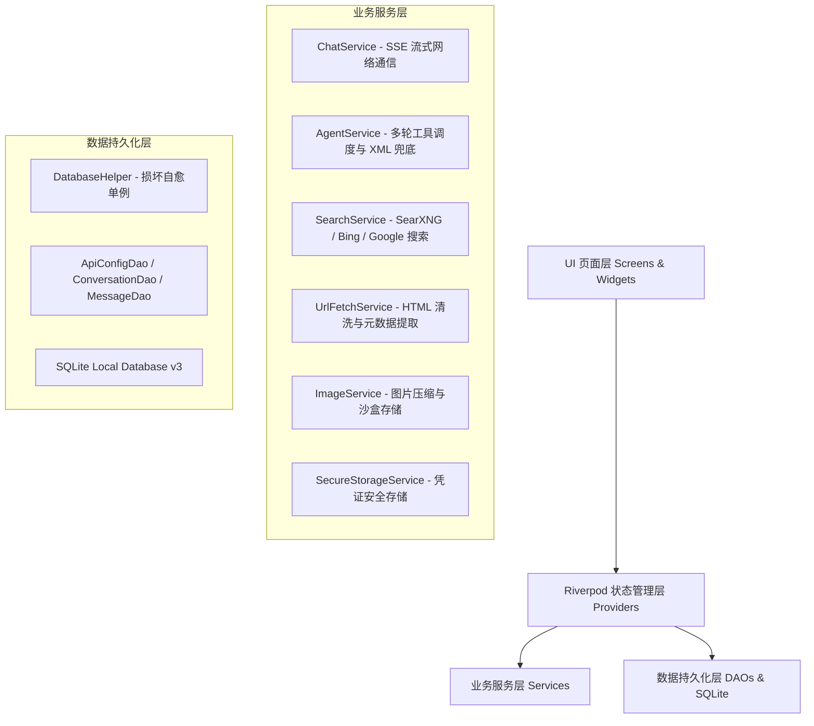

# 🤖 9Chat - 现代化 Flutter AI Agent 移动端客户端

<div align="center">


-003B57?style=for-the-badge&logo=sqlite&logoColor=white)


<p align="center">
  <b>一款基于 Flutter 构建的高颜值、高性能、高可用的全功能移动端 AI 智能体与对话客户端</b><br/>
  支持 OpenAI 规范接口 · 多轮 Tool Calling 智能体 · SearXNG/Bing 联网检索 · 结构化网页抓取 · 深度思考链可视化
</p>

</div>

---

## 📑 目录

- [✨ 核心特性](#-核心特性)
- [🏛️ 系统架构](#️-系统架构)
- [📂 目录结构](#-目录结构)
- [🚀 快速开始](#-快速开始)
  - [环境准备](#环境准备)
  - [获取代码与安装依赖](#获取代码与安装依赖)
  - [运行与调试](#运行与调试)
  - [打包编译](#打包编译)
- [🧪 测试与质量保证](#-测试与质量保证)
- [⚙️ 功能配置与使用指南](#️-功能配置与使用指南)
  - [1. API 提供商配置](#1-api-提供商配置)
  - [2. AI 联网搜索与抓取](#2-ai-联网搜索与抓取)
  - [3. 系统提示词定制](#3-系统提示词定制)
  - [4. 思考链与消息管理](#4-思考链与消息管理)
- [🛡️ 关键稳定性与安全设计](#️-关键稳定性与安全设计)
- [📈 路线图与版本迭代](#-路线图与版本迭代)
- [🤝 贡献与开发规范](#-贡献与开发规范)
- [📄 开源协议](#-开源协议)

---

## ✨ 核心特性

### 🌐 1. OpenAI 规范全兼容 & 多服务商接入
- **广泛兼容**：无缝对接 9Router、OpenAI、DeepSeek、Moonshot、Google AI Studio 等所有符合 `/v1/chat/completions` 标准的接口。
- **免 Key 开箱即用**：内置预置 **OpenCode Free** 免费通道（直连 `https://opencode.ai/zen/v1`），离线启动与初次安装自动加载 5 款主流免 Token 免费模型（如 `deepseek-v4-flash-free` 等）。
- **凭据安全**：API Key 采用 `flutter_secure_storage` 安全硬件加密存储，本地 SQLite 数据库仅存引用键（Ref），零明文泄露风险。
- **思考等级控制**：支持透传模型思考推理深度（`reasoningEffort: low / medium / high`）。

### 🛠️ 2. 强大的多轮 Tool Calling 与 Agent 引擎
- **标准与非标全兼容**：
  - 支持 OpenAI 标准 `tool_calls` 流式解析与回调执行。
  - 支持 DeepSeek DSML 语法（`<｜｜DSML｜｜tool_calls>` / `</｜｜DSML｜｜tool_calls>`）自动解析。
  - 支持伪 XML 标签（`<tool_call>...</tool_call>`）自动拦截兜底，非原生 Tool Call 模型也能化身全能 Agent。
- **超长工具循环保障**：支持最多 100 轮多工具连续调用，并在达到轮次阈值时启动强制文本总结（剥离 Tools 发起最终 Completion），防止 Agent 递归挂死或无响应。
- **过程状态折叠**：中间搜索过程、工具执行状态整泡折叠，只保留精简状态卡片，确保最终文本回答整洁清晰。

### 🔍 3. 多引擎联网搜索与结构化网页抓取
- **SearXNG 聚合搜索**：支持私有或公共 SearXNG 实例，支持双页并发查询（`pageno: 1 & 2`）与自动 URL 去重。
- **Bing 搜索（实验性增强）**：
  - 全球端点路由（自动绕过分词截断策略，支持多词精确检索）。
  - Cookie 跨域防剥离机制（5-hop 显式重定向转发，搜索记录可自动同步至个人 Bing 账号）。
  - 智能前置提取微软官方 AI 总结栏（`.cht_root` / `[data-scenario="nrt"]`）。
- **Google Grounding 接地**：深度整合 Google AI Studio 搜索接地内容与参考源。
- **结构化网页全文抓取 (`url_fetch`)**：
  - DOM 树智能清洗：剔除 `<script>`、`<style>`、`<noscript>` 等噪音标签。
  - 元数据提炼：自动抓取网页 `<title>`、`<meta description>`、`<meta keywords>`、`author` 等。
  - 表格自动解析：将 HTML `<table>` 转为高可读性的标准 Markdown 表格。
  - 智能截断：正文最大 8,000 字符限制，兼顾模型上下文窗口与抓取速度。
- **全局网络搜索开关**：在设置中一键开启/关闭 AI 外部工具调用。

### 🧠 4. 深度思考链与极致交互体验
- **Reasoning/Thinking 独立展示**：思考过程独立折叠/展开，支持长按自由选取文本与一键复制代码。
- **富文本 Markdown 渲染**：代码语法高亮、数学公式、链接点击跳转、图片内联渲染。
- **多样化复制操作**：长按气泡可选择「复制纯文本」（自动清洗 Markdown 符号）或「复制 Markdown 源码」。
- **对话生命周期管理**：
  - 消息编辑与重发（Edit & Resend）
  - 会话回退（Rollback）
  - 重新生成（Regenerate）
  - 实时 Token 消耗统计（Prompt Tokens / Completion Tokens / Total）
- **多模态视觉（Vision）**：支持拍照或相册选择图片，自动进行智能压缩并持久化存储至 App 沙盒目录。
- **防误触手势设计**：侧边栏对话列表移除了易误触的滑动删除，统一收拢至弹窗菜单，支持置顶、归档、修改与删除。

---

## 🏛️ 系统架构

本项目采用清晰的分层架构（Data -> Service -> Provider -> Screen/Widget），结合 **Riverpod** 响应式状态管理与 **SQLite** 持久化存储：



---

## 📂 目录结构

```
lib/
├── main.dart                     # 应用程序入口，全局初始化与 ProviderScope
├── app.dart                      # MaterialApp 根配置（多主题、路由映射）
│
├── models/                       # 核心数据模型 (JSON 序列化)
│   ├── api_config.dart           # API 服务商配置模型
│   ├── chat_message.dart         # 聊天消息模型（支持思考链、多模态、Tokens 统计）
│   ├── conversation.dart         # 对话元数据（置顶、归档、独立系统提示词）
│   ├── model_info.dart           # 模型元数据（Vision/Tools 能力标签）
│   ├── search_result.dart        # 统一搜索结果实体
│   ├── system_prompt_template.dart # 系统提示词模板
│   └── tool_call.dart            # 工具调用数据结构
│
├── data/                         # 数据访问对象 (DAO) 与数据库管理
│   ├── database_helper.dart      # SQLite 单例管理（含自愈重建机制与 Schema v3 迁移）
│   ├── api_config_dao.dart       # API 配置增删改查
│   ├── conversation_dao.dart     # 对话管理（置顶排序、归档、提示词保存）
│   └── message_dao.dart          # 消息持久化（绝对路径沙盒映射、Token 统计字段）
│
├── services/                     # 业务核心服务层
│   ├── chat_service.dart         # 基于 Dio 的 /v1/chat/completions SSE 流解析
│   ├── agent_service.dart        # 多轮 Tool Calling 调度、DSML/XML 兜底、轮次控制
│   ├── search_service.dart       # SearXNG 双页并发与 Bing 搜索（带 Cookie 穿透与 AI 总结）
│   ├── url_fetch_service.dart    # 网页全文抓取（DOM 清洗、元数据提取、表格转 Markdown）
│   ├── image_service.dart        # 图片压缩、沙盒持久化与 Base64 编码
│   └── secure_storage_service.dart # FlutterSecureStorage 硬件加密封装
│
├── providers/                    # Riverpod 状态管理层
│   ├── theme_provider.dart       # 主题模式（明亮 / 暗黑 / 跟随系统）
│   ├── api_config_provider.dart  # 当前活跃 API 及服务商列表管理
│   ├── model_provider.dart       # 模型列表拉取与选择状态
│   ├── conversation_provider.dart# 对话列表、置顶/归档及活跃会话
│   ├── chat_provider.dart        # 消息流式接收、编辑、回退、重新生成控制器
│   ├── agent_provider.dart       # Agent 搜索状态与网页读取进度
│   └── settings_provider.dart    # 搜索后端配置、Cookie、系统提示词模板
│
├── screens/                      # UI 页面
│   ├── home_screen.dart          # 主聊天界面（侧边栏、流式对话、提示词入口、操作弹窗）
│   ├── settings_screen.dart      # 全局设置页（搜索后端、Cookie、网络搜索开关）
│   ├── api_config_screen.dart    # API 提供商管理与连接测试页
│   ├── model_selector_screen.dart# 模型选择页（厂商分组、Vision/Tools 标签展示）
│   └── system_prompt_screen.dart # 系统提示词模板库与配置页
│
└── widgets/                      # 可复用 UI 组件
    ├── chat_bubble.dart          # 消息气泡（Markdown 渲染、思考区折叠、独立选区、Token 标签）
    └── chat_input.dart           # 输入框组件（图片选择、自动多行、停止生成）
```

---

## 🚀 快速开始

### 环境准备

确保您的本地开发环境满足以下要求：
- **Flutter SDK**: `>= 3.12.0` (推荐最新稳定版)
- **Dart SDK**: `>= 3.0.0`
- **Android SDK**: API Level 21 (Android 5.0) 或更高版本
- **开发工具**: Android Studio / VS Code (安装 Flutter 与 Dart 插件)

### 获取代码与安装依赖

```bash
# 1. 克隆代码仓库
git clone https://github.com/naruse-love/chat-app.git
cd chat-app

# 2. 安装 Flutter 依赖包
flutter pub get
```

### 运行与调试

```bash
# 查看已连接的设备
flutter devices

# 在连接的真机或模拟器上启动调试
flutter run
```

### 打包编译

```bash
# 编译 Android Debug APK
flutter build apk --debug
# 产物路径: build/app/outputs/flutter-apk/app-debug.apk

# 编译 Android Release APK (需配置签名文件)
flutter build apk --release
# 产物路径: build/app/outputs/flutter-apk/app-release.apk
```

---

## 🧪 测试与质量保证

本项目遵循极高标准的代码质量与稳定性规范，内置了 **167 个单元与集成测试用例**，覆盖了全部关键业务链路：

```bash
# 1. 静态代码分析（必须输出 0 issues）
flutter analyze

# 2. 运行全部单元测试与集成测试
flutter test
```

### 测试矩阵概览

| 测试套件 | 验证范围 |
| :--- | :--- |
| `database_concurrency_test.dart` | 数据库高并发多线程读写与事务完整性压力测试 |
| `database_corruption_recovery_test.dart` | SQLite 数据库意外损坏自愈与平滑重建测试 |
| `agent_service_test.dart` | 多轮 Tool Calling、DSML 解析、伪 XML 兜底、轮次上限防御 |
| `chat_service_test.dart` | SSE 流式断句、JSON 跨 Chunk 拼接与免 Key 直连测试 |
| `search_service_test.dart` | SearXNG 双页去重、Bing 跨域 Cookie 注入、AI 总结提取 |
| `url_fetch_service_test.dart` | HTML 节点清洗、元数据提炼、表格转 Markdown、8K 字符截断 |
| `e2e_integration_test.dart` | 全生命周期端到端测试（主题、配置、对话流式交互） |
| `adversarial_hardening_test.dart` | 对抗性异常注入测试（网络故障分类、超时拦截） |

---

## ⚙️ 功能配置与使用指南

### 1. API 提供商配置
- 点击主界面右上角进入「API 配置」页面。
- 支持添加任意 OpenAI 兼容端点（如 `https://api.openai.com/v1`、`https://api.deepseek.com/v1` 等）。
- 默认提供 **OpenCode Free** 免配置通道，无需提供 API Key 即可畅享 DeepSeek 等基础 AI 服务。

### 2. AI 联网搜索与抓取
进入「设置」页面的【网络搜索设置】区域：
- **AI 联网搜索开关**：可随时开启或关闭全局外部工具调用能力。
- **搜索后端选择**：
  - **SearXNG**（推荐）：填写 SearXNG 实例 URL（如 `https://searx.be` 或私有部署地址）。
  - **Bing 搜索（实验性）**：可填入网页端抓取的 `_U` / `MUID` / `SRCHHPGUSR` Cookie，实现个性化高权重搜索与 Bing 历史记录无缝同步。
  - **Google Grounding**：自动对接 Google AI Studio 搜索接地模型。

### 3. 系统提示词定制
- **全局预设模板**：在「系统提示词」页面创建并管理模板，可指定全局默认模板。
- **单会话独立覆盖**：在聊天主界面点击上方「提示词」图标，可为当前会话单独设定专属 System Prompt，满足不同场景下的角色定制需求。

### 4. 思考链与消息管理
- **思考内容控制**：AI 生成的思考逻辑会在气泡上方独立展示，可点击折叠/展开；长按支持独立选中文本。
- **消息操作菜单**：长按任意已发送/已接收气泡，可调出操作浮窗，支持「编辑并重发」、「从此处回退会话」、「重新生成本轮回答」以及「复制纯文本 / Markdown」。

---

## 🛡️ 关键稳定性与安全设计

1. **SQLite 损坏自愈重建机制 (`DatabaseHelper`)**
   - 在应用启动或热重载时，一旦捕获底层数据库文件物理损坏异常，自动执行安全备份与自愈重置，保证 App 永不因数据库损坏出现启动即白屏崩溃。
2. **Riverpod 异步 `mounted` 全链路守卫**
   - 彻底防范页面销毁后异步网络回调写入状态导致的 `StateNotifier.state was accessed after being disposed` 异常。
3. **路由动画延迟销毁防御**
   - 针对 Dialog 和 BottomSheet 弹窗的销毁周期，配置 300ms 缓冲延迟后再执行控制器 dispose，杜绝 Flutter 框架内部 `_dependents.isEmpty` 断言崩溃。
4. **Token 统计与沙盒存储安全**
   - 本地缓存图片一律压缩并持久化转存至沙盒 `Documents` 目录，防止系统缓存清理导致图片失效；数据库实时记录每条消息的 Token 开销。

---

## 📈 路线图与版本迭代

- [x] **Milestone 1-8**: 数据模型、SQLite DAO、SSE 流式解析、Agent 调度、Riverpod 状态管理、全套 Material 3 UI、异常对抗加固。
- [x] **Milestone 9-12**: 消息编辑/回退/重发、Token 统计、SearXNG 双页并发与 URL 去重、Google Grounding 接地、思考内容独立选区。
- [x] **Milestone 13-16**: `url_fetch` 结构化 Markdown 抓取、Bing 搜索多词及 Cookie 跨域透传、DSML 伪 XML 工具调用解析。
- [x] **Milestone 17-20**: Bing WAF 防火墙适配、首次搜索 Cookie 穿透修复、侧边栏手势防误触优化、全局搜索开关与元数据提炼。
- [ ] **未来规划**:
  - [ ] 国际化多语言支持（i18n / l10n）
  - [ ] 对话历史导出为 Markdown / JSON 文件
  - [ ] 语音输入集成（Speech to Text）
  - [ ] 用户自定义 Tool Call 插件扩展系统

> 详细的每次版本更新与变更记录请查阅 [WORK_LOG.md](WORK_LOG.md)。

---

## 🤝 贡献与开发规范

欢迎参与 9Chat 的开发与维护！请遵循以下规范：

1. **测试先行**：提交任何修改前，必须运行 `flutter test` 保证 **100% 测试通过**。
2. **代码规范**：运行 `flutter analyze` 确保 **0 issues**。
3. **Commit 规范**：使用语义化前缀提交（`feat:` / `fix:` / `test:` / `refactor:` / `docs:`）。
4. **版本号同步**：每次功能新增或代码修改，需在 `pubspec.yaml` 递增版本号并在 `WORK_LOG.md` 顶部追加记录。

---

## 📄 开源协议

本项目基于 [MIT License](LICENSE) 协议开源。
