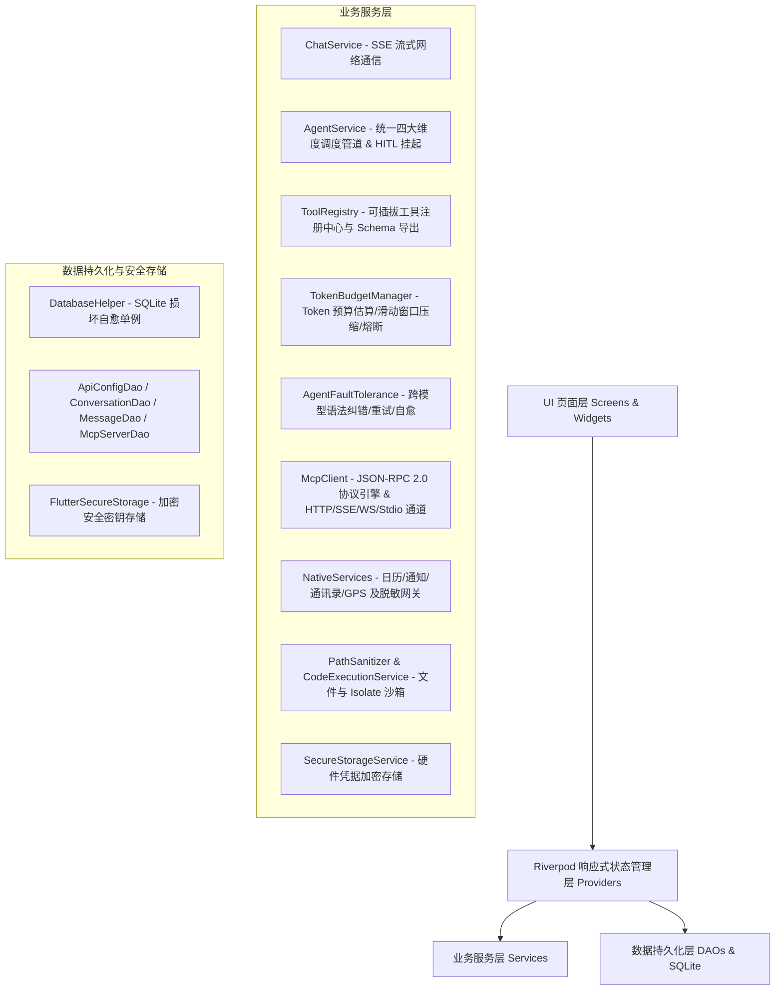

# 🤖 9Chat - 现代化 Flutter AI Agent 移动端客户端

<div align="center">


-003B57?style=for-the-badge&logo=sqlite&logoColor=white)

-brightgreen?style=for-the-badge)


<p align="center">
  <b>一款基于 Flutter 构建的高颜值、高性能、高可用的全功能移动端 AI 智能体与全生态工具客户端</b><br/>
  支持 OpenAI 规范 · MCP 客户端 (Streamable HTTP / SSE / WS / Stdio) · 本地沙箱文件与 Isolate 执行 · 移动原生特权 · Token 预算熔断 · 跨模型自愈
</p>

</div>

---

## 📑 目录

- [✨ 核心特性全景](#-核心特性全景)
  - [1. 开放模型与多服务商接入](#1-开放模型与多服务商接入)
  - [2. Model Context Protocol (MCP) 客户端与网桥](#2-model-context-protocol-mcp-客户端与网桥)
  - [3. 四大维度 22+ 智能体工具库](#3-四大维度-22-智能体工具库)
  - [4. 全局 Token 预算与滑动窗口压缩](#4-全局-token-预算与滑动窗口压缩)
  - [5. 跨模型容错与对抗自愈网关](#5-跨模型容错与对抗自愈网关)
  - [6. 深度思考链、执行时间线与 HITL 确认](#6-深度思考链执行时间线与-hitl-确认)
- [🏛️ 系统架构图与技术栈](#️-系统架构图与技术栈)
- [📂 核心目录与代码地图](#-核心目录与代码地图)
- [🚀 快速开始与编译部署](#-快速开始与编译部署)
  - [环境依赖](#环境依赖)
  - [安装依赖与运行](#安装依赖与运行)
  - [Android APK 编译打包](#android-apk-编译打包)
- [🧪 自动化测试与质量门禁](#-自动化测试与质量门禁)
- [🤖 AI Agent 快速接手与开发指南](#-ai-agent-快速接手与开发指南)
  - [快速接手清单](#快速接手清单)
  - [核心开发规范](#核心开发规范)
  - [常见陷阱与避坑指南](#常见陷阱与避坑指南)
- [📄 开源协议](#-开源协议)

---

## ✨ 核心特性全景

### 1. 开放模型与多服务商接入
- **广泛兼容**：无缝对接 OpenAI、9Router、DeepSeek、Moonshot、Google AI Studio 等所有符合 `/v1/chat/completions` 标准的服务商。
- **免 Key 开箱即用**：内置预置 **OpenCode Free** 免费通道（直连 `https://opencode.ai/zen/v1`），初次安装自动加载 5 款主流免 Token 免费模型（如 `deepseek-v4-flash-free`）。
- **凭据安全**：API Key 采用 `flutter_secure_storage` 安全硬件加密存储，本地 SQLite 数据库仅存引用键（Ref），绝无明文泄露风险。

### 2. Model Context Protocol (MCP) 客户端与网桥
- **四大多路传输通道 (Transports)**：
  - **Streamable HTTP (`type: "http"`, `POST /mcp`)**：符合 MCP 官方最新 HTTP 规范，直接通过 POST 携带 JSON-RPC 通信，支持单响应、批量响应、SSE 分块及 `Mcp-Session-Id` 会话维护；
  - **Server-Sent Events (SSE + POST)**：经典 SSE 传输通道，具备 400/404/405 智能降级自愈；
  - **WebSocket (WS / WSS)**：实时全双工长连接通道；
  - **Stdio (Process)**：本地子进程标准 I/O 管道（桌面端支持与优雅降级）。
- **动态工具发现与注销**：自动探测远程工具 Schema 转为 OpenAI Function Calling 格式，并以 `mcp_{serverId}_{toolName}` 命名空间动态注入 `ToolRegistry`，断开连接时自动注销。
- **一键 JSON 配置导入**：支持一键粘贴 Claude Desktop / Cursor / OpenCode 的标准 JSON 配置，自动解析服务名、协议与端点。

### 3. 四大维度 22+ 智能体工具库
系统内置 4 级安全权限模型（`Safe 0`、`ReadOnly 1`、`SensitiveConfirm 2`、`PrivilegedNative 3`）：

| 维度 | 工具名称 | 权限等级 | 功能描述 |
|---|---|:---:|---|
| **基础实用** | `math_eval` | Level 0 | 高精数学表达式、三角函数、统计计算与单位转换 |
| | `time_calculator` | Level 0 | 全球 IANA 时区查询、跨时区转换、相对时间与时间差计算 |
| | `weather_query` | Level 0 | Open-Meteo 免 Key 实时天气与 7 天逐日天气预报 |
| | `wiki_lookup` | Level 0 | 中英文 Wikipedia 百科条目检索与纯净摘要提取 |
| | `web_search` / `google_search` / `bing_search` | Level 0 | SearXNG 聚合检索、Google Grounding 接地与 Bing 搜索 |
| | `url_fetch` | Level 1 | 网页全文抓取、DOM 清洗、表格转 Markdown 与 8K 截断 |
| **文件与代码** | `file_read` | Level 1 | 本地沙箱文件安全读取（支持按行分块分页） |
| | `file_write` | Level 2 (HITL) | 本地沙箱文件写入与变更 Diff 快照生成 |
| | `file_list` | Level 1 | 递归遍历沙箱文件树（支持通配符 glob/正则） |
| | `file_delete` | Level 2 (HITL) | 本地沙箱文件安全删除 |
| | `code_eval` | Level 2 (HITL) | 独立 Worker Isolate 隔离脚本解释执行（3000ms 硬超时强杀） |
| | `clipboard_read` / `clipboard_write` | Level 1 / Level 2 | 系统剪贴板安全读取与写入 |
| **移动原生特权** | `calendar_query_events` | Level 3 | 时间范围日历日程检索 |
| | `calendar_create_event` | Level 3 (HITL) | 系统日历创建日程与重叠时间冲突预警 ($S_1 < E_2 \land E_1 > S_2$) |
| | `notification_schedule` | Level 3 (HITL) | 系统本地精准定时通知与闹钟提醒设定 |
| | `notification_cancel` | Level 3 | 取消与清空指定 ID 的待触发通知 |
| | `contacts_search` | Level 3 | 通过 `ContactsSanitizer` 安全脱敏检索通讯录（E.164 掩码 `+86 138****5678`、防注入转义、单次 5 条上限） |
| | `geolocation_get` | Level 3 | 获取当前 GPS 经纬度坐标与粗略定位 |
| | `reverse_geocode` | Level 0 | 经纬度逆向解析为具体街道/城市地址 |
| **远程动态** | `mcp_{serverId}_{toolName}` | 自定义 | 动态由外部 MCP Server 提供的远程特权/计算/数据工具 |

### 4. 全局 Token 预算与滑动窗口压缩 (`TokenBudgetManager`)
- **实时字符/Token 精准估算**：覆盖中文字符、英文单词、缩进代码、结构化 JSON 与 Emoji；
- **智能滑动窗口压缩**：超长多轮工具链中自动剪裁早期冗长的中间文本，保留工具签名与精炼头尾摘要，防止长会话上下文超限；
- **全局超限熔断器 (Circuit Breaker)**：达到 Token 硬上限时自动触发熔断，剥离工具链并强制模型做最终总结优雅收尾。

### 5. 跨模型容错与对抗自愈网关 (`AgentFaultTolerance`)
- **多模型语法入参纠错**：兼容修复 DeepSeek DSML v1/v2、Qwen XML、标准 OpenAI JSON、Llama 函数语法中的畸形转义、未闭合引号与非法逗号；
- **指数退避重试 (Exponential Backoff with Jitter)**：外部网络抖动或限流时自动重试；
- **自适应降级引导**：工具超时或崩溃时向大模型返回结构化中文友好错误上下文，促成自主计划修正。

### 6. 深度思考链、执行时间线与 HITL 确认
- **多步执行折叠时间线 (`AgentExecutionTimelineWidget`)**：直观展示 Agent 思考过程、步骤耗时、各维度工具调用链路与状态芯片；
- **Human-in-the-Loop 交互确认卡片 (`ToolConfirmationCard`)**：触发 Level 2/3 敏感操作时挂起等待用户确认，提供代码/文本 Diff 差异对比（`DiffViewerWidget`），支持用户一键允许或填写拒绝理由引导模型自适应调整；
- **Token 响应式胶囊徽章 (`TokenBudgetBadge`)**：实时显示单步与全局消耗，并在触发熔断时呈现直观警示卡片。

---

## 🏛️ 系统架构图与技术栈



---

## 📂 核心目录与代码地图

```
lib/
├── main.dart                          # 应用入口，全局初始化与 ProviderScope
├── app.dart                           # MaterialApp 根配置（多主题、路由映射）
│
├── models/                            # 数据模型 (JSON 序列化)
│   ├── agent_step_telemetry.dart      # Agent 多步执行遥测与统计模型
│   ├── api_config.dart                # API 服务商配置模型
│   ├── chat_message.dart              # 聊天消息模型（支持思考链、多模态、Tokens 统计）
│   ├── conversation.dart              # 对话元数据（置顶、归档、独立系统提示词）
│   ├── model_info.dart                # 模型元数据（Vision/Tools 能力标签）
│   ├── mcp/                           # MCP 协议模型
│   │   ├── mcp_json_rpc.dart          # JSON-RPC 2.0 协议对象
│   │   ├── mcp_server_config.dart     # MCP Server 持久化配置
│   │   ├── mcp_server_state.dart      # MCP Server 运行时状态
│   │   ├── mcp_tool_info.dart         # MCP 远程工具/资源/Prompt 元数据
│   │   └── mcp_transport_type.dart    # 传输类型枚举 (http/sse/websocket/stdio)
│   └── tool/                          # 工具基类与权限模型
│       ├── tool.dart                  # 标准 Tool 抽象基类
│       ├── tool_execution_result.dart # 执行结果与 Markdown/JSON 视图
│       └── tool_security_level.dart   # 4 级安全权限模型
│
├── data/                              # 数据访问对象 (DAO) 与数据库管理
│   ├── database_helper.dart           # SQLite 单例（损坏自愈与 Schema 迁移）
│   ├── api_config_dao.dart            # API 服务商配置持久化
│   ├── conversation_dao.dart          # 对话与会话持久化
│   ├── message_dao.dart               # 消息持久化（沙盒图片绝对路径映射）
│   └── mcp_server_dao.dart            # MCP 服务器配置与安全 Header 持久化
│
├── services/                          # 核心业务服务层
│   ├── chat_service.dart              # SSE 流式传输驱动
│   ├── agent_service.dart             # 四大维度工具统一调度管道与 HITL 协调
│   ├── tool_registry.dart             # 统一工具注册中心
│   ├── token_budget_manager.dart      # 全局 Token 预算与滑动窗口压缩引擎
│   ├── agent_fault_tolerance.dart     # 跨模型容错纠错与自愈网关
│   ├── agent_loop_guard.dart          # 死循环与振荡调用防御
│   ├── image_service.dart             # 图片压缩与沙盒存储
│   ├── secure_storage_service.dart    # 硬件安全密钥存储
│   ├── mcp/                           # MCP 核心服务
│   │   ├── json_rpc_engine.dart       # JSON-RPC 2.0 异步引擎
│   │   ├── mcp_client.dart            # MCP 协议核心驱动
│   │   ├── mcp_dynamic_tool.dart      # MCP 动态工具适配器
│   │   └── transports/                # HTTP / SSE / WebSocket / Stdio 传输实现
│   ├── native/                        # 移动原生特权服务抽象与脱敏
│   │   ├── calendar_service.dart      # 日历日程读写与冲突检测
│   │   ├── notification_service.dart  # 本地精准定时通知
│   │   ├── contacts_service.dart      # 通讯录服务
│   │   ├── contacts_sanitizer.dart    # 通讯录隐私脱敏与防注入网关
│   │   ├── location_service.dart      # GPS 定位与逆地理编码
│   │   └── permission_manager_service.dart # 统一权限管理与中文降级
│   └── tools/                         # 内置工具库实现 (file/code/math/time/weather/wiki)
│
├── providers/                         # Riverpod 状态管理层
│   ├── chat_provider.dart             # 消息流、编辑、回退、重新生成控制器
│   ├── agent_provider.dart            # Agent 多步遥测与执行状态
│   ├── mcp_provider.dart              # MCP 多 Server 生命周期管理
│   ├── conversation_provider.dart     # 会话管理
│   ├── api_config_provider.dart       # API 配置管理
│   ├── model_provider.dart            # 模型拉取与选择
│   ├── settings_provider.dart         # 设置项管理
│   └── theme_provider.dart            # 主题模式管理
│
├── screens/                           # 核心 UI 界面
│   ├── home_screen.dart               # 主聊天界面（侧边栏、流式对话、提示词入口）
│   ├── mcp_server_management_screen.dart # MCP 服务器可视化管理与一键 JSON 导入
│   ├── api_config_screen.dart         # API 提供商管理
│   ├── model_selector_screen.dart     # 模型选择页（厂商分组与能力标签）
│   ├── system_prompt_screen.dart      # 系统提示词模板库
│   └── settings_screen.dart           # 全局设置页
│
└── widgets/                           # 可复用 UI 视图组件
    ├── chat_bubble.dart               # 消息气泡（Markdown、思考面板、Token 胶囊）
    ├── chat_input.dart                # 输入框（图片上传、停止生成）
    ├── agent_execution_timeline.dart  # 多步执行折叠时间线组件
    ├── token_budget_badge.dart        # Token 消耗徽章与熔断卡片
    ├── tool_confirmation_card.dart    # HITL 交互确认卡片
    └── diff_viewer_widget.dart        # 代码/文本差异 Diff 对比组件
```

---

## 🚀 快速开始与编译部署

### 环境依赖
- **Flutter SDK**: `>= 3.12.0`（推荐使用项目关联 SDK：`D:\work\flutter-sdk\flutter\bin\flutter.bat`）
- **Dart SDK**: `>= 3.0.0`
- **Android SDK**: API Level 21+（Android 5.0 及以上）
- **JDK**: Java 17+

### 安装依赖与运行

```bash
# 1. 克隆项目
git clone https://github.com/naruse-love/chat-app.git
cd chat-app

# 2. 安装 Flutter 依赖
flutter pub get

# 3. 运行调试
flutter run
```

### Android APK 编译打包

```bash
# 编译 Android Debug APK
D:\work\flutter-sdk\flutter\bin\flutter.bat build apk --debug
# 产物输出路径: build/app/outputs/flutter-apk/app-debug.apk

# 编译 Android Release APK (需配置签名文件)
flutter build apk --release
# 产物输出路径: build/app/outputs/flutter-apk/app-release.apk
```

---

## 🧪 自动化测试与质量门禁

本项目强制执行 **100% 测试通过率** 与 **0 静态分析问题** 严格质量红线：

```bash
# 1. 静态代码分析（必须输出 No issues found!）
D:\work\flutter-sdk\flutter\bin\flutter.bat analyze

# 2. 运行全量 777 个自动化测试用例（必须 100% 通过）
D:\work\flutter-sdk\flutter\bin\flutter.bat test
```

### 测试矩阵概览（777 个测试全部通过）

| 测试套件 | 验证范围 |
|---|---|
| `test/services/token_budget_manager_test.dart` | Token 字符精准估算、滑动窗口修剪摘要保留、全局超限熔断器 |
| `test/services/agent_fault_tolerance_test.dart` | DSML/XML/JSON 畸形入参自动纠错、退避重试与 Jitter、自愈错误格式化 |
| `test/services/unified_agent_pipeline_test.dart` | 四大维度工具统一协同调度端到端链路与步骤遥测一致性 |
| `test/services/mcp/*_test.dart` | HTTP (POST /mcp)、SSE 智能降级、WS、Stdio、JsonRpcEngine、McpClient 协议 |
| `test/services/native_tools_test.dart` | 日历冲突算法、通知提醒、通讯录 E.164 掩码脱敏与防注入网关、GPS 逆编码 |
| `test/services/path_sanitizer_test.dart` | 路径穿越防御、符号链接逃逸防御、5MB/50MB 沙箱配额限制 |
| `test/services/code_execution_service_test.dart`| Worker Isolate 脚本执行与 3000ms 硬超时强杀回收 |
| `test/widgets/*_test.dart` | 执行时间线、Token 徽章、HITL 确认卡片、DiffViewer、聊天气泡渲染交互 |
| `test/e2e_integration_test.dart` | 完整生命周期端到端测试 |

---

## 🤖 AI Agent 快速接手与开发指南

> **写给接手此项目的 AI Agent**：请严格遵守本节规范与约定，确保项目演进的高效与质量。

### 快速接手清单（按序执行）

1. **阅读 [AGENTS.md](.agents/AGENTS.md)** 与 **[context.md](.agents/context.md)**，恢复完整的项目上下文；
2. **查阅 [WORK_LOG.md](WORK_LOG.md)** 了解最近版本迭代与技术决策；
3. 运行静态分析验证现状：
   ```powershell
   D:\work\flutter-sdk\flutter\bin\flutter.bat analyze
   ```
   （必须为 `No issues found!`）
4. 运行全量回归测试确认基线状态：
   ```powershell
   D:\work\flutter-sdk\flutter\bin\flutter.bat test
   ```
   （必须为 `All tests passed!` 0 failures）
5. 明确任务目标后方可开展代码变更。

### 核心开发规范（不可违反）

1. **测试必须 100% 全部通过**：每次修改后必须重跑 `flutter test`，严禁提交存在测试失败的代码；
2. **静态分析 0 问题**：必须输出 `No issues found!`，不接受任何 warning 或 error；
3. **中文 UI 与友好错误**：所有面向用户的界面文字、错误提示、SnackBar 内容统一使用中文；
4. **版本号递增规范**：每次新增功能（feat）、修复缺陷（fix）或变更代码，必须给项目版本号递增 0.01（在 `pubspec.yaml` 的 `version` 字段、`WORK_LOG.md` 顶部与 `.agents/context.md` 同步递增）；
5. **更新 WORK_LOG.md**：每次实质性变更必须在项目根目录 `WORK_LOG.md` **顶部**追加记录，包含变更文件列表与核心技术指标；
6. **Git 提交规范**：使用标准语义化前缀（`feat:` / `fix:` / `test:` / `refactor:` / `docs:`），提交后执行 `git push`。

### 常见陷阱与避坑指南

| 场景 / 陷阱 | 正确做法 |
|---|---|
| **Riverpod StateNotifier 异步写入** | 所有 `await` 异步调用之后必须第一行检查 `if (!mounted) return;`，防止已销毁组件报错。 |
| **可空状态更新 (`copyWith`)** | 可空字段（如 `activeConversation`）必须通过标志参数（如 `clearActive: true`）处理，禁止直接传 `null` 导致 fallback 到旧值。 |
| **SQLite 操作规范** | 必须通过对应 DAO 操作数据库，禁止在 Provider 或 Widget 中硬编码 `db.rawQuery`。 |
| **测试中使用安全存储 / SP** | 必须使用 `MockFlutterSecureStorage`（基于 `noSuchMethod`）并调用 `SharedPreferences.setMockInitialValues({})`。 |
| **持久化图片路径** | 图片必须通过 `ImageService.compressAndSaveImage()` 压缩后保存至 `Documents` 沙盒，数据库只存永久绝对路径。 |
| **MCP Streamable HTTP 协议** | MCP `POST /mcp` 端点需直接发送 HTTP POST 请求并支持处理 JSON 与 SSE 流，不可仅发送 GET。 |

---

## 📄 开源协议

本项目基于 [MIT License](LICENSE) 协议开源。
