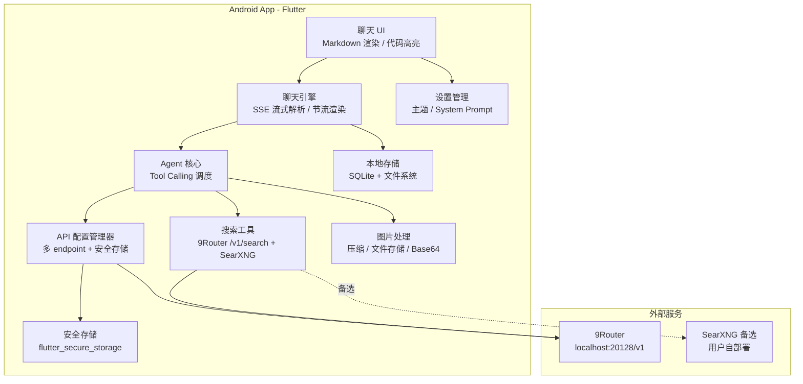
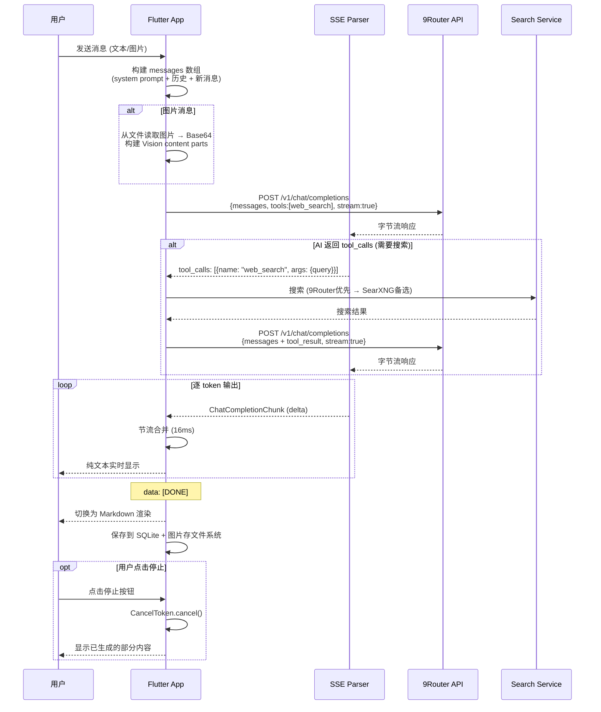

# AI Agent App — 基于 9Router 的 Android 智能助手（v2 修订版）

基于 [9Router](https://github.com/decolua/9router) 的 OpenAI 兼容 API，构建一个功能丰富的 Android AI Agent App。App 提供类 ChatGPT 的聊天体验，支持联网搜索、图片识别、多 API 配置管理，以及流式输出。

> [!NOTE]
> v2 修订版：整合了 [review_findings.md](file:///D:/work/chat/review_findings.md) 中的审查意见，所有 P0 全部采纳，P1/P2 选择性采纳。详见末尾[变更日志](#变更日志v1--v2)。

---

## 需求摘要

| 决策项 | 选择 |
|--------|------|
| **技术栈** | Flutter (Dart)，仅 Android |
| **UI 风格** | 类 ChatGPT 聊天界面，对话气泡 + Markdown 渲染 + 代码高亮 |
| **API 连接** | 用户自部署 9router，设置中填入 endpoint + API Key |
| **多 API 支持** | ✅ 支持多个 API 配置，聊天时可切换 |
| **模型选择** | 自动获取 `/v1/models` + 手动输入自定义模型名 |
| **联网搜索** | 双模式：9Router 内置搜索（优先）+ SearXNG 备选；AI 自动 + `@search` 手动触发 |
| **图片输入** | 拍照 + 相册选图（粘贴板延后），压缩后 Base64 发送（OpenAI Vision 格式） |
| **存储** | 本地 SQLite + 文件系统（图片存文件，数据库存路径） |
| **主题** | 暗色主题为主，可切换亮色 |
| **额外功能** | 流式输出、Markdown 渲染、代码高亮 + 一键复制、停止生成 |
| **System Prompt** | 模板库 + 自定义 |

---

## 架构概览



---

## Proposed Changes

### 1. 项目初始化与基础配置

#### [NEW] Flutter 项目 — `d:\work\chat`

```yaml
dependencies:
  # 状态管理
  flutter_riverpod: ^2.5.0
  # HTTP 请求
  dio: ^5.4.0
  # 本地数据库
  sqflite: ^2.3.0
  path_provider: ^2.1.0
  # 安全存储（API Key 加密）
  flutter_secure_storage: ^9.0.0
  # Markdown 渲染
  flutter_markdown: ^0.7.0
  # 代码高亮
  highlight: ^0.7.0
  # 图片选择
  image_picker: ^1.0.0
  # 图片压缩
  flutter_image_compress: ^2.1.0
  # UUID
  uuid: ^4.3.0
  # JSON 序列化
  json_annotation: ^4.8.0
  # 共享偏好设置
  shared_preferences: ^2.2.0
  # URL 打开（Markdown 链接跳转）
  url_launcher: ^6.2.0

dev_dependencies:
  # 代码生成
  build_runner: ^2.4.0
  json_serializable: ^6.7.0
  flutter_test:
    sdk: flutter
  flutter_lints: ^3.0.0
```

#### [NEW] Android 配置 — `android/app/src/main/AndroidManifest.xml`

```xml
<uses-permission android:name="android.permission.INTERNET"/>
<uses-permission android:name="android.permission.CAMERA"/>
<uses-feature android:name="android.hardware.camera" android:required="false"/>
```

`android/app/build.gradle` 设置 `minSdkVersion 21`。

---

### 2. 数据模型层

#### [NEW] `lib/models/api_config.dart`

API 配置模型：
- `id` (String): 唯一标识
- `name` (String): 配置名称（如 "我的 9Router"、"直连 OpenAI"）
- `baseUrl` (String): API endpoint（如 `http://192.168.1.100:20128/v1`）
- `apiKeyRef` (String): 指向 `flutter_secure_storage` 中的 key 引用（**不存明文**）
- `isDefault` (bool): 是否为默认配置
- `createdAt` (DateTime)

> [!IMPORTANT]
> API Key 不直接存入 SQLite。使用 `flutter_secure_storage`（基于 Android Keystore + EncryptedSharedPreferences）加密存储，数据库中只保存引用 key。

#### [NEW] `lib/models/model_info.dart`

模型信息模型（解析 9router 的 `provider/model` 格式）：
```dart
@JsonSerializable()
class ModelInfo {
  final String id;              // 完整 ID: "openai/gpt-4o"
  final String provider;        // 解析出的 provider: "openai"
  final String modelName;       // 解析出的模型名: "gpt-4o"
  final bool supportsVision;    // 是否支持图片输入
  final bool supportsTools;     // 是否支持 tool calling
  final String? ownedBy;        // /v1/models 返回的 owned_by 字段

  factory ModelInfo.fromApiResponse(Map<String, dynamic> json) {
    final id = json['id'] as String;
    final parts = id.split('/');
    return ModelInfo(
      id: id,
      provider: parts.length > 1 ? parts[0] : 'unknown',
      modelName: parts.length > 1 ? parts.sublist(1).join('/') : id,
      // ...
    );
  }
}
```

#### [NEW] `lib/models/tool_call.dart`

工具调用模型：
```dart
@JsonSerializable()
class ToolCall {
  final String id;
  final String type;            // "function"
  final String functionName;
  final String arguments;       // JSON 字符串
}
```

#### [NEW] `lib/models/chat_message.dart`

消息模型：
- `id` (String): 唯一标识
- `conversationId` (String): 所属会话 ID
- `role` (String): `user` / `assistant` / `system` / `tool`
- `content` (String): 文本内容
- `reasoningContent` (String?): 模型思考过程（DeepSeek-R1 等的 `reasoning_content`）
- `imagePath` (String?): 本地图片文件路径（数据库存路径，不存 Base64）
- `toolCalls` (List\<ToolCall\>?): AI 请求的工具调用
- `toolCallId` (String?): 工具调用结果的 ID
- `timestamp` (DateTime)

#### [NEW] `lib/models/conversation.dart`

会话模型：
- `id` (String)
- `title` (String): 会话标题
- `apiConfigId` (String): 使用的 API 配置
- `modelId` (String): 使用的模型
- `systemPrompt` (String?): 自定义 System Prompt
- `isPinned` (bool): 是否置顶
- `isArchived` (bool): 是否归档
- `createdAt` / `updatedAt` (DateTime)

#### [NEW] `lib/models/system_prompt_template.dart`

System Prompt 模板（同 v1，不变）。

---

### 3. 本地存储层

#### [NEW] `lib/data/database_helper.dart`

SQLite 数据库管理：
- `conversations` 表
- `messages` 表（`imagePath` 代替 `imageBase64`）
- `api_configs` 表（`apiKeyRef` 代替明文 `apiKey`）
- `system_prompts` 表
- **版本迁移**：使用 `onUpgrade` 回调实现逐版本 schema 升级

```dart
await openDatabase(
  path,
  version: _databaseVersion,
  onCreate: _onCreate,
  onUpgrade: _onUpgrade,  // 逐版本升级
);

Future<void> _onUpgrade(Database db, int oldVersion, int newVersion) async {
  if (oldVersion < 2) {
    await db.execute('ALTER TABLE conversations ADD COLUMN isPinned INTEGER DEFAULT 0');
    await db.execute('ALTER TABLE conversations ADD COLUMN isArchived INTEGER DEFAULT 0');
  }
  if (oldVersion < 3) {
    // 未来扩展...
  }
}
```

#### [NEW] `lib/data/conversation_dao.dart` / `message_dao.dart` / `api_config_dao.dart`

DAO 层：各表的 CRUD 操作封装，与 `database_helper` 分离。

---

### 4. 网络服务层

#### [NEW] `lib/services/chat_service.dart`

聊天 API 服务（对齐 9router OpenAI 兼容接口）：
- `POST /v1/chat/completions`（流式 `stream: true`）
  - 支持 `messages` 数组（含 text + image_url content parts）
  - 支持 `tools` 参数（function calling / 搜索工具）
  - 使用 `dio.ResponseType.stream` 获取字节流
  - 委托 `SSEParser` 解析流式事件
- `GET /v1/models` — 获取可用模型列表，解析为 `ModelInfo`
- **CancelToken** 支持 — 用于停止生成

#### [NEW] `lib/services/sse_parser.dart`

独立的 SSE 流解析器：
```dart
class SSEParser {
  /// 解析 SSE 字节流为 ChatCompletionChunk 事件流
  Stream<ChatCompletionChunk> parse(Stream<List<int>> byteStream) async* {
    // 1. utf8.decoder 解码字节流
    // 2. 按 \n\n 分割事件
    // 3. 解析 data: 前缀的 JSON 行
    // 4. 处理 data: [DONE] 结束标记
    // 5. 缓冲区管理（处理跨块不完整行）
    // 6. 错误恢复
  }
}
```

#### [NEW] `lib/services/search_service.dart`

双模式搜索服务：

```dart
class SearchService {
  /// 优先使用 9Router 内置搜索（如果可用）
  /// 降级到 SearXNG
  Future<List<SearchResult>> search(String query) async {
    // 1. 尝试 9Router: POST {baseUrl}/search?q=...
    // 2. 如果 9Router 搜索不可用（404/未配置），
    //    降级到 SearXNG: GET {searxngUrl}/search?q=...&format=json
    // 3. 解析结果：提取标题、URL、摘要
    // 4. 格式化为上下文文本，供 AI 参考
  }
}
```

> [!NOTE]
> 9Router README 未明确提到 `/v1/search` 端点。实现中需要先探测该接口是否可用，不可用则自动降级到 SearXNG。

#### [NEW] `lib/services/agent_service.dart`

Agent 核心调度：
- **Tool 定义**：`web_search` 工具的 JSON Schema
- **调用流程**：
  1. 发送用户消息 + tools 定义给 AI
  2. AI 返回 `tool_calls` → 执行搜索
  3. 搜索结果作为 `tool` role 消息返回
  4. AI 基于搜索结果生成最终回复
- **手动触发**：`@search` 前缀
- **停止生成**：通过 `CancelToken.cancel()` 中断流式请求

---

### 5. 图片处理

#### [NEW] `lib/services/image_service.dart`

- 拍照 / 相册选图（`image_picker`）
- 图片压缩（目标 < 1MB，最大 1024px 边长）
- **存储到文件系统**：`app_dir/images/{messageId}.jpg`，数据库只存路径
- 发送时从文件临时读取转 Base64 data URI（仅在内存中构建，不持久化 Base64）
- 构建 OpenAI Vision 格式消息

> [!IMPORTANT]
> 粘贴板图片输入延后到 v2。Flutter 剪贴板图片读取跨平台支持不成熟，第一版只做拍照 + 相册。

---

### 6. 状态管理层

#### Provider 拆分（7 个）

```
lib/providers/
├── conversation_provider.dart   # 会话列表 CRUD、切换、置顶/归档
├── chat_provider.dart           # 当前会话消息列表、发送/接收、流式输出状态
├── api_config_provider.dart     # API 配置管理（含 secure storage 读写）
├── model_provider.dart          # 模型列表（从 /v1/models 获取 + 手动输入）
├── agent_provider.dart          # Agent 工具调用状态（搜索中/搜索完成）
├── theme_provider.dart          # 暗色/亮色主题切换
└── settings_provider.dart       # SearXNG 地址、通用设置
```

---

### 7. UI 层

#### [NEW] `lib/screens/home_screen.dart`

主页面：
- 左侧抽屉菜单：会话历史列表（支持置顶 / 归档）
- 顶部栏：当前模型 + API 配置选择器
- 中间：聊天消息列表（`ListView.builder` 虚拟化）
- 底部：输入栏组件
- **停止生成按钮**：流式输出时显示，点击触发 `CancelToken.cancel()`

#### [NEW] `lib/screens/settings_screen.dart`

设置页面：
- API 配置管理
- 搜索配置：SearXNG 地址（备选）
- 主题切换
- 关于

#### [NEW] `lib/screens/api_config_screen.dart`

API 配置编辑页面：
- 名称、Endpoint URL、API Key 输入
- 测试连接按钮
- 模型列表拉取

#### [NEW] `lib/screens/model_selector_screen.dart`

模型选择页面：
- 自动获取的模型列表（按 provider 分组展示）
- 手动输入自定义模型名
- 搜索过滤
- 显示模型 capabilities 标签（Vision / Tools）

#### [NEW] `lib/screens/system_prompt_screen.dart`

System Prompt 管理（同 v1）。

---

### 8. Widget 组件层

#### [NEW] `lib/widgets/chat_bubble.dart`

聊天气泡组件：
- 用户消息（右对齐）
- AI 回复（左对齐，Markdown 渲染）
- **reasoning_content 折叠面板**：模型思考过程可展开/收起
- 工具调用状态指示（🔍 搜索中...）
- 图片消息缩略图预览

#### [NEW] `lib/widgets/chat_input.dart`

输入栏组合组件：
- 文本输入框（多行自适应）
- 附件按钮（拍照/选图）
- 发送按钮
- 已选图片预览（可取消）

#### [NEW] `lib/widgets/markdown_renderer.dart`

Markdown 渲染组件：
- 标题、列表、粗体、斜体、链接（`url_launcher` 跳转）
- 代码块语法高亮（`highlight` 库）+ 一键复制按钮
- 表格渲染
- **流式渲染优化**：流式输出时用纯 `Text`，流结束后切换 `Markdown`
- **节流**：每 16ms 合并一次 token 更新

#### [NEW] `lib/widgets/image_picker_button.dart`

图片选择按钮：
- 底部弹出菜单：拍照 / 相册
- 选中后显示缩略图预览
- 可取消已选图片

---

### 9. 主题系统

#### [NEW] `lib/theme/app_theme.dart`

同 v1（暗色/亮色方案不变）：
- 暗色主题（默认）：背景 `#1A1A2E`，主色 `#0F3460`，强调色 `#E94560`
- 亮色主题：背景 `#F5F5F5`，主色 `#2196F3`

---

### 10. 工具类

#### [NEW] `lib/utils/sse_decoder.dart`

SSE 事件解码辅助（低层级字节流处理）。

#### [NEW] `lib/utils/image_utils.dart`

图片压缩/编码辅助函数。

#### [NEW] `lib/constants/api_constants.dart`

API 路径常量（`/v1/chat/completions`、`/v1/models` 等）。

#### [NEW] `lib/constants/database_constants.dart`

表名、列名常量。

---

### 11. 内置 System Prompt 模板

同 v1（6 个预置模板）：
1. 🤖 通用助手 2. 💻 代码专家 3. 🌐 翻译助手 4. ✍️ 文案写手 5. 📊 数据分析师 6. 🎯 任务规划师

---

## 项目目录结构

```
d:\work\chat/
├── lib/
│   ├── main.dart
│   ├── app.dart                           # MaterialApp + ProviderScope 配置
│   ├── constants/
│   │   ├── api_constants.dart             # API 路径常量
│   │   ├── database_constants.dart        # 表名、列名
│   │   └── ui_constants.dart              # UI 尺寸/间距常量
│   ├── models/
│   │   ├── api_config.dart
│   │   ├── model_info.dart                # 新增：含 provider 解析 + capabilities
│   │   ├── chat_message.dart              # + reasoningContent + imagePath
│   │   ├── conversation.dart              # + isPinned + isArchived
│   │   ├── tool_call.dart                 # 新增：结构化 ToolCall
│   │   └── system_prompt_template.dart
│   ├── data/
│   │   ├── database_helper.dart           # + onUpgrade 迁移
│   │   ├── conversation_dao.dart
│   │   ├── message_dao.dart
│   │   └── api_config_dao.dart
│   ├── services/
│   │   ├── chat_service.dart              # + CancelToken 停止生成
│   │   ├── sse_parser.dart                # 新增：独立 SSE 流解析器
│   │   ├── search_service.dart            # 双模式：9Router + SearXNG
│   │   ├── agent_service.dart
│   │   └── image_service.dart             # 图片存文件系统
│   ├── providers/
│   │   ├── conversation_provider.dart     # 新增：从 chat_provider 拆出
│   │   ├── chat_provider.dart
│   │   ├── api_config_provider.dart       # + secure storage
│   │   ├── model_provider.dart            # 新增：模型列表管理
│   │   ├── agent_provider.dart            # 新增：工具调用状态
│   │   ├── theme_provider.dart
│   │   └── settings_provider.dart
│   ├── screens/
│   │   ├── home_screen.dart               # + 停止生成按钮
│   │   ├── settings_screen.dart
│   │   ├── api_config_screen.dart
│   │   ├── model_selector_screen.dart     # + provider 分组 + capability 标签
│   │   └── system_prompt_screen.dart
│   ├── widgets/
│   │   ├── chat_bubble.dart               # + reasoning 折叠面板
│   │   ├── chat_input.dart                # 新增：输入栏组合组件
│   │   ├── markdown_renderer.dart         # + 延迟渲染 + 节流优化
│   │   ├── image_picker_button.dart
│   │   └── model_dropdown.dart
│   ├── theme/
│   │   └── app_theme.dart
│   └── utils/
│       ├── sse_decoder.dart               # 新增
│       ├── image_utils.dart               # 新增
│       └── date_utils.dart                # 新增
├── android/
│   └── app/src/main/AndroidManifest.xml   # + CAMERA + INTERNET 权限
├── pubspec.yaml                           # + secure_storage, highlight, url_launcher, build_runner
└── README.md
```

---

## 核心流程

### 聊天 + Agent Tool Calling 流程



---

## Verification Plan

### 自动化测试
```bash
# 代码生成
flutter pub run build_runner build --delete-conflicting-outputs

# 单元测试
flutter test

# 构建测试
flutter build apk --debug
```

### 手动验证
1. **API 连接**：配置 9router 地址，验证模型列表获取 + provider 分组显示
2. **API Key 安全**：确认 API Key 不出现在 SQLite 数据库文件中
3. **聊天功能**：发送文本消息，验证流式输出 → 纯文本显示 → 结束后 Markdown 渲染
4. **停止生成**：流式输出中点击停止，验证请求取消 + 部分内容保留
5. **图片输入**：拍照/选图发送，验证图片存文件系统 + Vision API 调用
6. **联网搜索**：验证 AI 自动搜索 + 手动 `@search` 触发 + 搜索降级逻辑
7. **多 API 切换**：添加多个 API 配置，验证切换和模型重新加载
8. **主题切换**：验证暗色/亮色主题切换
9. **数据持久化**：关闭重开 app，验证聊天记录 + 图片正常加载
10. **reasoning_content**：使用 DeepSeek-R1 等模型，验证思考过程折叠面板

---

## 变更日志（v1 → v2）

> 基于 [review_findings.md](file:///D:/work/chat/review_findings.md) 的审查意见整合

| # | 变更 | 来源 | 理由 |
|---|------|------|------|
| 1 | 新增 `ModelInfo` 类，解析 `provider/model` 格式 | P0-1 | 9router 模型 ID 需要结构化解析 |
| 2 | 搜索改为双模式（9Router 优先 + SearXNG 备选） | P0-2 | 减少用户额外部署负担，但需探测接口可用性 |
| 3 | `ToolCall` 结构化 + `reasoningContent` 字段 | P0-3 | `List?` 过于模糊；reasoning 对 DeepSeek 等有用 |
| 4 | API Key 使用 `flutter_secure_storage` 加密存储 | P0-4 | SQLite 明文存储有安全风险 |
| 5 | 补充 `build_runner` + `json_serializable` | P0-5 | `json_annotation` 的必要配套 |
| 6 | `flutter_highlight` → `highlight`；增加 `url_launcher` | P1-6 | 旧库不维护；Markdown 链接需要跳转 |
| 7 | Provider 拆分为 7 个 | P1-7 | 分离关注点，避免 chat_provider 过重 |
| 8 | 图片存文件系统，数据库存路径 | P1-8 | 避免 Base64 拖慢 SQLite |
| 9 | 流式输出：延迟 Markdown 渲染 + 16ms 节流 | P1-9 | 关键性能优化 |
| 10 | 数据库 `onUpgrade` 迁移方案 | P1-10 | 为 schema 升级做准备 |
| 11 | Android 权限 + `minSdkVersion 21` | P1-11 | 必要的 Android 配置 |
| 12 | 独立 `sse_parser.dart` | P1-12 | SSE 解析逻辑复杂，值得独立 |
| 13 | 停止生成按钮纳入 v1 | P2-13 | 流式输出的刚需功能 |
| 14 | 目录增加 `constants/` `data/` `utils/` | P2-14 | 更清晰的分层 |
| 15 | 粘贴板图片延后到 v2 | P2-15 | Flutter 支持不成熟 |
| 16 | 会话增加 `isPinned` / `isArchived` 字段 | P2-13 | 预留扩展 |

### 未采纳项

| # | 审查意见 | 未采纳理由 |
|---|---------|-----------|
| P1-6 `sqflite` → `drift` | `drift` 学习成本高，`sqflite` + DAO 层已够用；后续可迁移 |
| P2-13 消息编辑/重发 | v1 不做，v2 可加 |
| P2-13 Token 用量统计 | v1 不做，v2 可加 |
| P2-13 对话搜索 FTS5 | v1 不做，v2 可加 |
| P2-13 导出聊天记录 | v1 不做，v2 可加 |
| P2-16 9Router 高级 API | 未来可扩展（embeddings、图片生成、TTS 等） |
