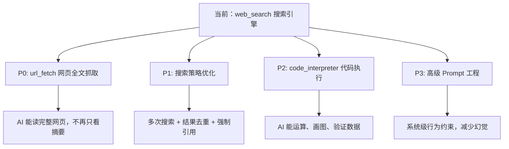

# 提升 AI 回答准确性 — 完整实现方案

## 问题分析

当前 App 只有一个工具 `web_search`，搜索引擎只返回 **标题 + 摘要**（通常 50-100 字），AI 需要基于这些碎片化信息来合成答案。这就像让人只看书的目录来写读书报告 —— 信息严重不足。

---

## 方案总览

我把可以做的改进分为 **4 个优先级**，每个都可以独立实现，互不依赖。



---

## P0: `url_fetch` — 网页全文抓取（⭐ 最推荐）

> [!IMPORTANT]
> 这是**投入产出比最高**的改进。仅靠搜索摘要，AI 的信息获取量大约只有完整网页的 5%~10%。

### 为什么需要

| 现状 | 改进后 |
|------|--------|
| 搜索返回 10 条结果，每条 ~50 字摘要 | AI 可以读取 2-3 个最相关页面的完整内容 |
| AI 基于 500 字碎片合成答案 | AI 基于 5000-10000 字全文合成答案 |
| 无法获取表格、代码、详细数据 | 可以获取结构化内容 |

### 工具定义

```json
{
  "type": "function",
  "function": {
    "name": "url_fetch",
    "description": "Fetch the full content of a web page given its URL. Use this after web_search to read the complete content of promising search results. Returns the page content as clean text (HTML tags stripped).",
    "parameters": {
      "type": "object",
      "properties": {
        "url": {
          "type": "string",
          "description": "The URL of the web page to fetch and read."
        }
      },
      "required": ["url"]
    }
  }
}
```

### 技术实现

#### [NEW] `lib/services/url_fetch_service.dart`
- 使用 Dio 发 GET 请求获取网页 HTML
- 用 `html` 包（已有依赖）解析 DOM，提取 `<article>`、`<main>`、`<body>` 中的文字
- 去除 `<script>`、`<style>`、`<nav>`、`<footer>` 等无关标签
- 限制返回内容最大长度（~8000 字符），避免超出 LLM 上下文窗口
- 超时设置 10 秒，避免阻塞
- 错误处理：404、超时、编码问题等

#### [MODIFY] `lib/services/agent_service.dart`
- 新增 `urlFetchTool` 静态常量定义
- `chatAndSearchStream()` 传入 `tools: [webSearchTool, urlFetchTool]`
- 工具执行分发：根据 `functionName` 分发到 `SearchService` 或 `UrlFetchService`
- 伪 XML 兜底也支持 `url_fetch`

#### [MODIFY] `lib/providers/chat_provider.dart`
- `AgentService` 构造器注入 `UrlFetchService`
- Provider 依赖更新

#### [MODIFY] `lib/providers/agent_provider.dart`
- 新增状态：`isFetchingUrl`、`fetchingUrl` 用于 UI 展示

### 预期效果

```
用户: 2024 年诺贝尔物理学奖得主是谁？他们的贡献是什么？

当前行为:
  → 搜索 "2024 Nobel Physics Prize"
  → 得到摘要: "John Hopfield and Geoffrey Hinton won for neural network discoveries"
  → AI 基于这一句话编造详情

改进后:
  → 搜索 "2024 Nobel Physics Prize"
  → 抓取 nobelprize.org 官方页面全文
  → AI 基于 5000 字官方介绍详细回答
```

---

## P1: 搜索策略优化（零代码/低代码改进）

> [!TIP]
> 这些改进不需要新增工具，通过优化现有流程就能显著提升准确性。

### 1a. 优化 System Prompt — 搜索行为约束

#### [MODIFY] `lib/providers/settings_provider.dart`

将默认 system prompt 从 `You are a helpful assistant.` 改为包含搜索策略的版本：

```
你是一个严谨、准确的 AI 助手。遵循以下规则：

1. **事实优先**：对于任何涉及具体事实、数据、日期、人名的问题，必须先使用 web_search 搜索验证后再回答。
2. **引用来源**：回答中引用的每个关键事实，都必须标注来源 URL。
3. **诚实不确定性**：如果搜索结果不够充分或相互矛盾，明确告知用户信息的不确定性。
4. **不要编造**：绝对不要编造 URL、数据、引文或任何具体事实。如果不知道，说"我不确定"。
5. **多角度搜索**：如果第一次搜索结果不够充分，使用不同关键词再搜索一次。
```

### 1b. 搜索结果格式优化

#### [MODIFY] `lib/services/search_service.dart` → `formatSearchResultsForContext()`

当前格式只有标题/URL/摘要，可以增加引导语让 AI 更好利用搜索结果：

```dart
String formatSearchResultsForContext(List<SearchResult> results) {
  final buffer = StringBuffer();
  buffer.writeln('以下是网络搜索结果。请仔细阅读后基于这些信息回答用户问题。');
  buffer.writeln('如果需要更详细的信息，请使用 url_fetch 工具读取相关页面全文。');
  buffer.writeln('回答时请引用来源 URL。');
  buffer.writeln();
  for (int i = 0; i < results.length; i++) {
    final r = results[i];
    buffer.writeln('${i + 1}. [${r.title}](${r.url})');
    buffer.writeln('   摘要: ${r.content}');
    buffer.writeln();
  }
  return buffer.toString().trim();
}
```

### 1c. 增加搜索结果数量

当前 SearXNG 默认返回 ~10 条结果，可以在请求参数中增加 `pageno` 或 `categories` 来获取更多/更精准的结果。

---

## P2: `code_interpreter` — 代码执行沙箱

> [!WARNING]
> 这个功能实现复杂度较高，需要后端沙箱环境支持。有两种方案可选。

### 为什么需要

| 场景 | 没有 code_interpreter | 有 code_interpreter |
|------|----------------------|---------------------|
| "计算 123456 × 789012" | AI 可能算错 | Python 精确计算 |
| "这组数据的平均值是多少？" | AI 心算容易出错 | pandas 精确统计 |
| "帮我画个折线图" | 无法实现 | matplotlib 生成图表 |
| "这段代码有 bug 吗？" | 纯文字分析 | 实际运行验证 |

### 方案 A：调用远程沙箱 API（推荐）

使用开源的 [Piston](https://github.com/engineer-man/piston) 或 [Judge0](https://judge0.com/) 作为代码执行后端：

```json
{
  "type": "function",
  "function": {
    "name": "code_interpreter",
    "description": "Execute Python code in a sandboxed environment. Use this for mathematical calculations, data analysis, or code verification. Returns stdout and stderr.",
    "parameters": {
      "type": "object",
      "properties": {
        "code": {
          "type": "string",
          "description": "Python code to execute."
        }
      },
      "required": ["code"]
    }
  }
}
```

#### 新增文件
- [NEW] `lib/services/code_execution_service.dart` — 调用远程沙箱 API
- [MODIFY] `lib/services/agent_service.dart` — 注册工具并分发执行
- [MODIFY] `lib/providers/settings_provider.dart` — 新增沙箱 URL 配置
- [MODIFY] `lib/screens/settings_screen.dart` — 沙箱 URL 设置 UI

### 方案 B：纯 AI 端计算（低成本替代）

不实际执行代码，而是让 AI 把数学问题分解为步骤，利用搜索引擎验证关键中间结果。
这只需要优化 system prompt，无需新代码。

---

## P3: 高级 Prompt 工程

### 3a. 自我反思机制（Self-Reflection）

在 system prompt 中加入：
```
在给出最终答案前，请先在 <thinking> 中自检：
- 我的回答中是否有未经验证的具体事实？
- 搜索结果之间是否有矛盾？
- 我是否编造了任何 URL 或数据？
```

你的 App 已经支持显示 `reasoningContent`（思考区），这个机制可以直接利用。

### 3b. 多轮搜索验证

当前最多支持 5 轮 tool calling（`_streamCompletionsLoop` 中 `toolRound >= 4`），这已经足够支持：

```
第 1 轮: web_search("主题关键词")
第 2 轮: url_fetch(最相关结果的 URL)  
第 3 轮: web_search("验证性关键词") — 交叉验证
第 4 轮: url_fetch(第二来源 URL)
第 5 轮: 综合所有信息给出最终答案
```

这个流程只需要通过 system prompt 引导，不需要额外代码。

### 3c. 置信度标注

在 system prompt 中要求 AI 在回答末尾标注置信度：

```
📊 信息置信度：
- ✅ 高确信（多个可靠来源一致）: ...
- ⚠️ 中确信（单一来源或非权威来源）: ...
- ❓ 低确信（未找到可靠来源）: ...
```

---

## 实施建议 & 优先级

| 优先级 | 方案 | 工作量 | 准确性提升 | 依赖 |
|--------|------|--------|-----------|------|
| **P0** | `url_fetch` 网页全文抓取 | 1-2 天 | ⭐⭐⭐⭐⭐ | 无新依赖 |
| **P1** | 搜索策略 + Prompt 优化 | 2-4 小时 | ⭐⭐⭐⭐ | 无 |
| **P2** | `code_interpreter` | 2-3 天 | ⭐⭐⭐ | 需要沙箱后端 |
| **P3** | 高级 Prompt 工程 | 1-2 小时 | ⭐⭐⭐ | 无 |

> [!IMPORTANT]
> **建议执行顺序**：先做 P1（最快见效）→ 再做 P0（最大收益）→ P3 可以穿插在任何阶段 → P2 看需求决定。

---

## Open Questions

1. **P0 `url_fetch`**：你希望限制抓取内容的最大长度是多少？建议 8000 字符（约 3000 tokens），还是更长？
2. **P2 `code_interpreter`**：你有自己的服务器可以部署 Piston/Judge0 沙箱吗？还是倾向于用纯 Prompt 方案替代？
3. **P1 System Prompt**：你希望默认 system prompt 用中文还是英文？（当前是英文 "You are a helpful assistant."）
4. **整体**：你希望我一次性实现哪些方案？还是逐个来？

---

## 验证计划

### 自动化测试
- `D:\work\flutter-sdk\flutter\bin\flutter.bat test` — 全部 127 测试必须通过
- `D:\work\flutter-sdk\flutter\bin\flutter.bat analyze` — 0 issues
- 为 `UrlFetchService` 新增单元测试（HTML 解析、超时处理、内容截断）
- 为 `AgentService` 更新测试（`url_fetch` 工具分发 + 伪 XML 兜底）

### 手动验证
- 实际对话测试：问一个事实性问题，观察 AI 是否先搜索、再读取网页、再引用来源回答
